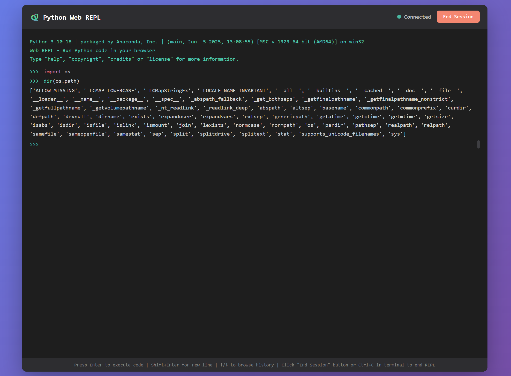

# Python Web REPL

A beautiful, modern web-based Python REPL (Read-Eval-Print Loop) that runs in your browser. Execute Python code interactively through an elegant web interface with syntax highlighting and command history.




## Installation

Simply download the `webrepl.py` file - no installation required! The module uses only Python standard library components.

```bash
# Download the file
wget https://raw.githubusercontent.com/hanakokoizumi/python-webrepl/main/src/webrepl.py

# Or clone the repository
git clone https://github.com/hanakokoizumi/python-webrepl.git
cd python-webrepl
```

## Quick Start

### Basic Usage

```python
import webrepl

# Start Web REPL with default settings (random free port)
webrepl.interact()
```

### Custom Configuration

```python
import webrepl

# Specify a custom port
webrepl.interact(port=8080)

# Custom host and port
webrepl.interact(host="0.0.0.0", port=8080)

# Custom banner message
webrepl.interact(banner="Welcome to My Python REPL!")

# Provide local variables
my_var = 42
webrepl.interact(local=locals())
```

### Example Script

```python
import webrepl

# Set up some variables
x = 10
y = 20

def greet(name):
    return f"Hello, {name}!"

# Start REPL with access to local variables
print("Starting Web REPL...")
print("You can access variables: x, y, and function: greet()")
webrepl.interact(local=locals())

# Code continues after REPL session ends
print("REPL session ended. Continuing with script...")
```

## API Reference

### `webrepl.interact()`

Start a Web REPL interactive session.

**Parameters:**

- `banner` (str, optional): Welcome banner text displayed when REPL starts
- `readfunc` (optional): Compatibility parameter (not used, for code.interact() compatibility)
- `local` (dict, optional): Local namespace dictionary for the REPL session
- `exitmsg` (str, optional): Message displayed when REPL session ends
- `host` (str, default="localhost"): Server host address
- `port` (int, optional): Server port (None = auto-select random free port)
- `echo_terminal` (bool, optional): Whether to echo browser input/output to terminal

**Returns:** None

**Example:**

```python
import webrepl

webrepl.interact(
    banner="Custom Python REPL v1.0",
    local={"my_var": 42},
    exitmsg="Thanks for using the REPL!",
    host="localhost",
    port=8000,
    echo_terminal=True
)
```

## Security Considerations

⚠️ **Important Security Notes:**

- By default, the server binds to `localhost` (127.0.0.1), making it accessible only from your local machine
- If you bind to `0.0.0.0`, the REPL will be accessible from other machines on your network
- **Never expose Web REPL to the internet without proper authentication**
- The REPL has full access to your Python environment and can execute arbitrary code
- Use only in trusted environments

## Contributing

Contributions are welcome! Please feel free to submit a Pull Request.
